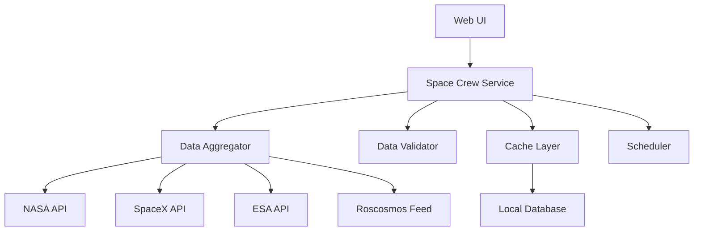

# Design Document: Real-Time Space Crew Tracker

## Overview

The Real-Time Space Crew Tracker is a data-driven feature that provides accurate, current information about astronauts and cosmonauts currently in space. The system aggregates data from multiple official space agency sources, validates information accuracy, and presents it through a responsive web interface integrated into the existing NASA OSDR Explorer application.

## Architecture

### High-Level Architecture



### Component Responsibilities

- **Web UI**: Streamlit-based interface for displaying crew information
- **Space Crew Service**: Core business logic and API coordination
- **Data Aggregator**: Collects data from multiple space agency sources
- **Data Validator**: Cross-references and validates crew information accuracy
- **Cache Layer**: Stores validated crew data for fast access and offline functionality
- **Scheduler**: Manages automatic data refresh cycles

## Components and Interfaces

### 1. Data Sources Integration

**Primary Data Sources:**
- NASA ISS API (https://api.nasa.gov/iss-now/)
- SpaceX API (https://api.spacexdata.com/v4/crew)
- ESA Human Spaceflight API
- Launch Library API (https://ll.thespacedevs.com/2.2.0/)

**Data Source Interface:**
```python
class SpaceDataSource:
    def get_current_crew(self) -> List[CrewMember]
    def get_mission_details(self, mission_id: str) -> MissionData
    def validate_connection(self) -> bool
    def get_last_update_time(self) -> datetime
```

### 2. Space Crew Service

**Core Service Interface:**
```python
class SpaceCrewService:
    def get_current_astronauts(self) -> List[CrewMember]
    def get_crew_member_details(self, crew_id: str) -> CrewMemberDetails
    def refresh_crew_data(self) -> RefreshResult
    def validate_data_freshness(self) -> ValidationResult
```

### 3. Data Validation Engine

**Validation Strategy:**
- Cross-reference crew lists from at least 2 sources
- Validate launch/return dates against mission timelines
- Flag discrepancies for manual review
- Maintain confidence scores for each data point

### 4. Streamlit UI Components

**Main Components:**
- Current Crew Dashboard
- Individual Crew Member Cards
- Mission Timeline View
- Data Freshness Indicators
- Error/Warning Notifications

## Data Models

### CrewMember Model
```python
@dataclass
class CrewMember:
    id: str
    name: str
    nationality: str
    agency: str
    current_vehicle: str
    launch_date: datetime
    expected_return: Optional[datetime]
    mission_duration_days: int
    profile_image_url: Optional[str]
    status: CrewStatus  # ACTIVE, RETURNING, UNKNOWN
```

### MissionData Model
```python
@dataclass
class MissionData:
    mission_id: str
    mission_name: str
    agency: str
    launch_date: datetime
    expected_duration_days: int
    mission_objectives: List[str]
    spacecraft: str
    destination: str  # ISS, Tiangong, etc.
```

### DataFreshness Model
```python
@dataclass
class DataFreshness:
    last_update: datetime
    source_name: str
    confidence_level: float  # 0.0 to 1.0
    validation_status: ValidationStatus
    next_refresh: datetime
```

## Error Handling

### Data Source Failures
- **Timeout Handling**: 30-second timeout for API calls
- **Fallback Strategy**: Use cached data if primary sources fail
- **Retry Logic**: Exponential backoff for failed requests
- **User Notification**: Clear indicators when using cached vs. live data

### Data Validation Errors
- **Conflicting Information**: Flag discrepancies and show confidence levels
- **Missing Data**: Graceful degradation with partial information display
- **Stale Data Detection**: Automatic flagging of data older than 12 hours

### UI Error States
- **Loading States**: Progress indicators during data refresh
- **Error Messages**: User-friendly explanations of data issues
- **Offline Mode**: Clear indication when displaying cached data

## Testing Strategy

### Unit Testing
- Data source connector validation
- Data model serialization/deserialization
- Validation logic accuracy
- Cache layer functionality

### Integration Testing
- End-to-end data flow from sources to UI
- Cross-source data validation accuracy
- Scheduler reliability testing
- Error handling scenarios

### Data Accuracy Testing
- Compare results against known crew manifests
- Validate update timing against actual mission events
- Test conflict resolution between sources

## Performance Considerations

### Caching Strategy
- **Local Cache**: SQLite database for crew data
- **Cache Duration**: 6-hour default, 2-hour for status changes
- **Cache Invalidation**: Event-driven updates for launches/returns

### API Rate Limiting
- **Request Throttling**: Respect API rate limits for each source
- **Batch Processing**: Combine related API calls where possible
- **Monitoring**: Track API usage and response times

### UI Performance
- **Lazy Loading**: Load detailed crew information on demand
- **Image Optimization**: Compress and cache crew profile images
- **Responsive Design**: Optimize for mobile and desktop viewing

## Security Considerations

### API Security
- **API Key Management**: Secure storage of API credentials
- **HTTPS Only**: All external API calls over secure connections
- **Input Validation**: Sanitize all external data inputs

### Data Privacy
- **Public Information Only**: Display only publicly available crew information
- **No Personal Data**: Avoid storing sensitive personal information
- **Compliance**: Follow space agency data usage guidelines

## Integration with Existing System

### Streamlit Integration
- **New Page**: Add "Current Astronauts" to main navigation
- **Shared Components**: Reuse existing UI theme and styling
- **Session Management**: Integrate with existing session handling

### Database Integration
- **Existing Neo4j**: Optionally store crew relationships and mission connections
- **MongoDB**: Use existing MongoDB for caching crew data
- **Configuration**: Leverage existing config management system